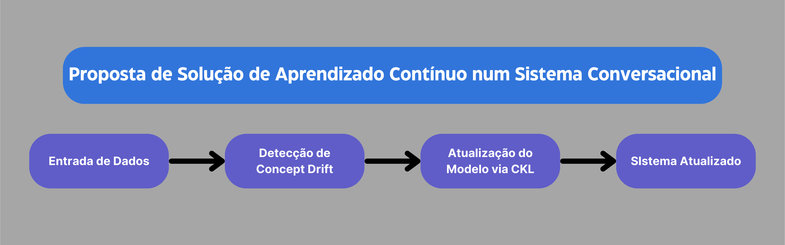

# Proposta de Solução de Aprendizado Contínuo em um Sistema Conversacional

## Introdução
A atualização contínua dos modelos de linguagem é um desafio complexo no campo de Machine Learning e Inteligência Artificial (AI). Este problema é agravado pelo chamado 'Concept Drift', um fenômeno onde o modelo não consegue se manter atualizado, refletindo em uma mudança gradual ou repentina dos padrões de dados ao longo do tempo. A incapacidade dos modelos de se adaptarem a essas mudanças pode afetar o desempenho e relevância, afetando principalmente sistemas conversacionais (como chatbots e assistentes virtuais) onde a falta de atualização pode resultar em respostas imprecisas e irrelevantes.

## Solução Proposta
Visando o problema do "concept drift" em sistemas conversacionais, desenvolvemos uma solução baseada em aprendizado contínuo, com base no paradigma do "Continual Knowledge Learning", presente no artigo.
### Diagrama de Blocos

### Descrição dos Blocos
1. **Coleta de Dados**: É crucial obter dados em tempo real, seguido por uma fase de pré-processamento para assegurar que os dados estejam devidamente limpos e formatados.
2. **Detecção de Concept Drift**: A qualidade das respostas do sistema é monitorada continuamente, e algoritmos são empregados para identificar alterações nos dados. Quando mudanças são detectadas, alertas são emitidos para indicar a necessidade de atualizações.
3. **Atualização do Modelo via CKL**: Utiliza-se técnicas de aprendizado contínuo para atualizar o modelo. O CKL tem como objetivo atualizar constantemente o conhecimento dos modelos de linguagem, mantendo o conhecimento que permanece relevante ao longo do tempo, substituindo informações obsoletas e incorporando novos conhecimentos. O CKL divide o conhecimento do mundo em três categorias: conhecimento constante, conhecimento obsoleto e novo conhecimento.
4. **Sistema Atualizado**: Com a implementação do modelo atualizado, testes comparativos são conduzidos para medir sua eficácia. O sistema também inclui mecanismos de feedback dos usuários para colher impressões sobre a qualidade das interações.

## Conclusão
A adoção de um modelo de aprendizado contínuo é fundamental para garantir a atualidade e efetividade de sistemas conversacionais. Esta abordagem permite que os modelos de linguagem atualizem e renovem seu conhecimento interno, mantendo-se alinhados com as constantes mudanças do mundo real. Com isso, é possível fornecer respostas não apenas precisas, mas também contextualmente relevantes. Embora o desafio de implementar um sistema seja considerável, os benefícios em termos de acurácia e satisfação do usuário são muito valiosos, respectivamente.

## Referência Bibliográfica
- JAYARATNE, Dinithi et al. Continuous detection of concept drift in industrial cyber-physical systems using closed loop incremental machine learning. Discover Artificial Intelligence, v. 1, 2021.
